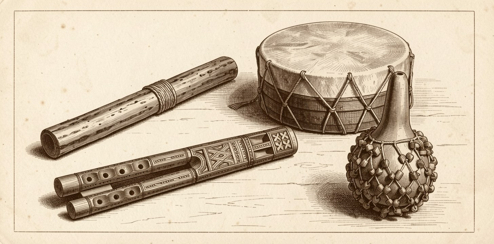

# drone_flute_synth



### ▶ [**Play it**](https://kleer001.github.io/drone_flute_synth/)

**Your five-piece chill-out band, in a tab.**

Pick the key, the scale and the mood, then add a drum, a rattle or a rain
stick. Set the levels and how much of each goes to the reverb. Then leave it on.

It never stops. It won't play you the same phrase twice in a row.

Nothing to install. The flute and code download in 3.4 MB, and each
percussion pool loads when you switch it on. All five: 6.8 MB.

## Start it somewhere

[A phrygian](https://kleer001.github.io/drone_flute_synth/?key=A&mode=phrygian) ·
[F# blues, restless](https://kleer001.github.io/drone_flute_synth/?key=F%23&mode=blues&mood=restless) ·
[D dorian with a drum](https://kleer001.github.io/drone_flute_synth/?key=D&mode=dorian&drum=1&rattle=1) ·
[ceremonial, in song form](https://kleer001.github.io/drone_flute_synth/?mood=ceremonial&song=1) ·
[C whole tone, half asleep](https://kleer001.github.io/drone_flute_synth/?key=C&mode=whole%20tone&mood=sleep)

## What it sounds like

It breathes. The melody runs until a player would need air, then everything
goes quiet for a moment and comes back in on the beat. The drone breathes with
it, because on a real drone flute both pipes share one lungful.

The drum doesn't keep time. It answers. Where the tune left a gap, the drum
plays; where the tune leaned on a beat, it stays out. The two interlock instead
of doubling up.

The rattle works the other way. It takes the phrase's own rhythm and stretches
it, then runs that figure through the breath and the silence after it.
Something steady to float over.

Washes from the rain stick are rare on purpose. One comes through, eight
seconds of grains, and won't come back for another four breaths.

Left alone it wanders forever. Turn on **song form** and it works in blocks
instead. A block is a call and its answer. It shuffles a handful of them into a
section, plays the section back with the repeats, then writes a new section. No
block ever follows itself.

Pick a key and a scale, slide some drones in underneath, and leave it going.
It's meant to be left on.

Every performance has a seed. Same seed, same piece, drums and all.

## Controls

| | |
|---|---|
| **key** | any of the twelve |
| **scale** | major, minor, the modes, harmonic minor, both pentatonics, blues, whole tone |
| **octave** | where the tune sits, nudged in octaves, beside the key and scale it is played in. Two down still sounds like a flute. One up gets shrill, which is sometimes what you want |
| **drone 1–3** | three of them. Each on or off, at whatever interval you want under the tune |
| **mood** | contemplative, mourning, pastoral, ceremonial, restless, sleep. Picking one moves every slider it owns, tempo included |
| **song form** | on or off, how many blocks, and how many times each one comes back |
| **drum** | on or off, and which — frame drum large or small, cabasa, guiro. **drum fill** is how much of the room the tune left it decides to use |
| **rattle** | four pools of its own — shaker large or small, cabasa, guiro. **rattle stretch** is how far the tune's figure is pulled out before it repeats; **rattle fill** is how much it subdivides between that figure's own strokes |
| **rain stick** | on or off, and **rain stick rate** for how often a wash comes through |
| **the sliders** | how busy it is, how far it leaps, how much it decorates, how fast it moves, how long a breath lasts, how long the player takes to draw one |
| **mix** | a level for each of the five instruments, and how much of each reaches the reverb and the delay |
| **effects** | six rooms from dry to canyon, and a delay counted in sixteenths so it stays in time when the tempo moves |

Changes to the performance land on the next breath, so you never hear a phrase
change its mind halfway through. The mix and the effects move while it plays.

The URL sets where it starts:
`?key=A&mode=phrygian&mood=sleep&seed=42`, plus `song=1`, `blocks=4`,
`repeats=2`, `drum=1`, `rattle=1` and `wash=1`.

<details>
<summary><b>How it comes up with the tune</b></summary>

<br>

It isn't shuffling notes. It writes a little phrase, three to five notes long,
then spends the next few breaths arguing with it: the same phrase backwards,
upside down, stretched long, cut off halfway.

Breaths come in pairs. The first one asks something and leaves it hanging,
lower and plainer. The second answers, and the answer is always the question
reworked rather than a new idea, which is why the two sound related. After
three or so goes it drops the phrase and writes another.

Inside a breath there's one high point, about two thirds through, and the line
climbs to it and comes back down. It lands on notes that sit still against the
drone, and it leans on the beat, so what you hear could be written on paper.

Turn **call / answer** up to hear the two halves pull apart. Turn **ornament**
up and it starts showing off.

The percussion is made of that same phrase. Stretch the motif's durations and
you have the rattle's figure; take the holes the motif left and you have the
drum's. That's why the band sounds like it's listening instead of running
alongside.

</details>

## Run it yourself

```bash
./run.sh
```

Serves the same files the public page does.

## Made of

Thirteen recordings of a baroque soprano recorder, and fifty-two percussion
one-shots. They come from a frame drum large and small, two shakers, a cabasa,
a guiro and an ocean drum. All of it is
[VCSL](https://github.com/sgossner/VCSL), which is public domain.

A recorder isn't a drone flute, and an ocean drum isn't a rain stick. Both are
what a free licence gets you: the gesture is right, the timbre is standing in.
The controls name the role. So the ocean drum is the **rain stick** on the
page, and the shakers are the **rattle**.

The banner is drawn from four photographs on Wikimedia Commons: a carved
dvojnice by Claire H. (CC BY-SA 2.0), a frame drum from the Tropenmuseum
(CC BY-SA 3.0), a shekere by PROTechThor (CC BY-SA 4.0), and a rain stick by
Andy Brice (public domain). Being a derivative of the three share-alike
photographs, [the banner](docs/banner.jpg) is CC BY-SA 4.0.

The code is [MIT](LICENSE). If you want to know how it works inside, that's
[CLAUDE.md](CLAUDE.md).
